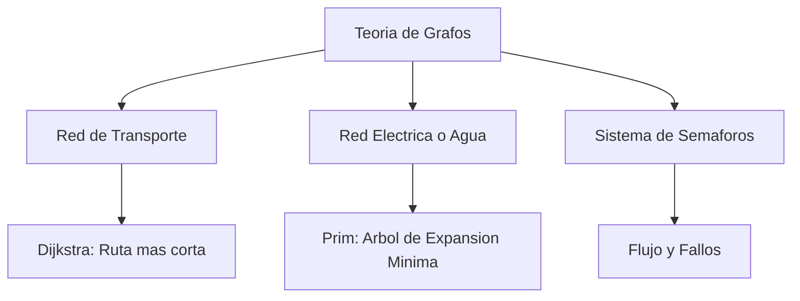

# 🧮 Maqueta Digital Interactiva – Matemática Discreta


-green)


Proyecto interactivo que modela **sistemas reales mediante teoría de grafos**, implementando:
- **Dijkstra** – rutas más cortas  
- **Prim / MST** – árbol de expansión mínima  
- **Semáforos** – simulación de flujo y fallos

---

## 🚀 Estructura de la maqueta


---

*Nota:* Cada módulo permite **editar parámetros**, **visualizar el grafo** y **observar los resultados en tiempo real**.

---

## ⚙️ Componentes principales

| Módulo | Descripción | Algoritmo |
|:-------|:-------------|:-----------|
| Red de transporte 🚍 | Calcula la ruta más corta entre dos puntos del mapa. | Dijkstra |
| Red eléctrica / agua ⚡ | Determina la red óptima de conexiones con menor costo. | Prim (MST) |
| Sistema de semáforos 🚦 | Simula ciclos de tráfico con tiempos configurables. | Grafos de flujo |

---

## 💻 Cómo ejecutar

1. **Clona este repositorio:**
   ```bash
   git clone https://github.com/jeanma0x/proyecto_mate_discreta.git
2. **Abre** el archivo `index.html` en tu navegador o usa **Live Server** (VS Code).  
3. **Explora** las secciones y modifica parámetros para ver los resultados.

---

## 📘 Algoritmos en resumen

- **Dijkstra:** selecciona el nodo más cercano no visitado y actualiza las distancias mínimas.  
- **Prim (MST):** agrega la arista de menor costo que conecta un nodo nuevo sin formar ciclos.  
- **Semáforos:** alterna entre fases N–S y E–O, simulando fallos mediante la desactivación de aristas.

---

## 👨‍💻 Desarrollado por

**Jorge Zamora**, **Gabriel Contreras** y **Jean Marco Portillo**  
📍 *Universidad del Valle de Guatemala – Campus Sur*  
📅 *Curso: Matemática Discreta*

---

## 📜 Licencia

Uso **educativo y libre**.

